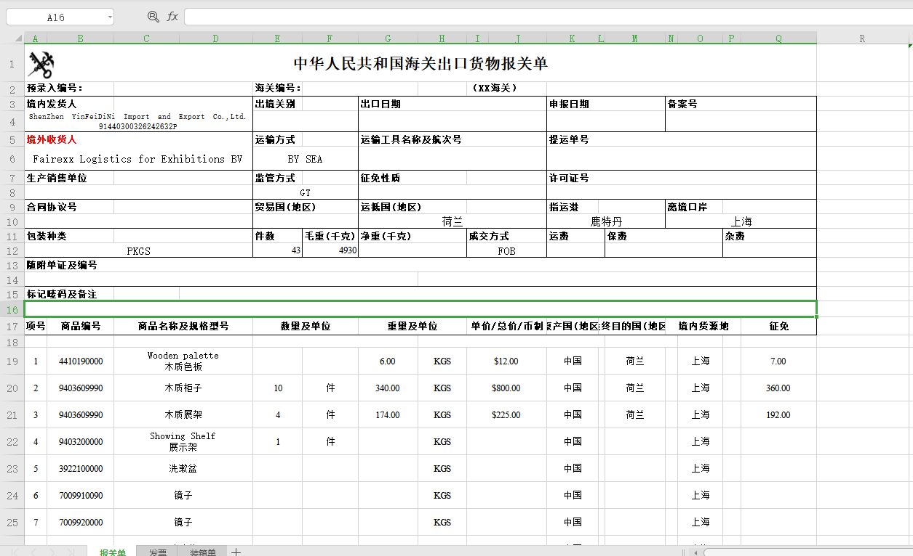
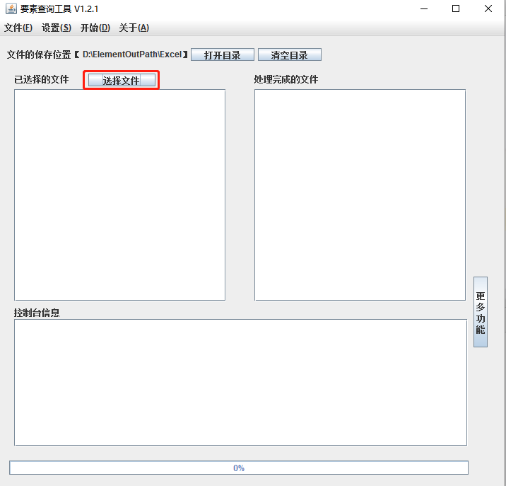
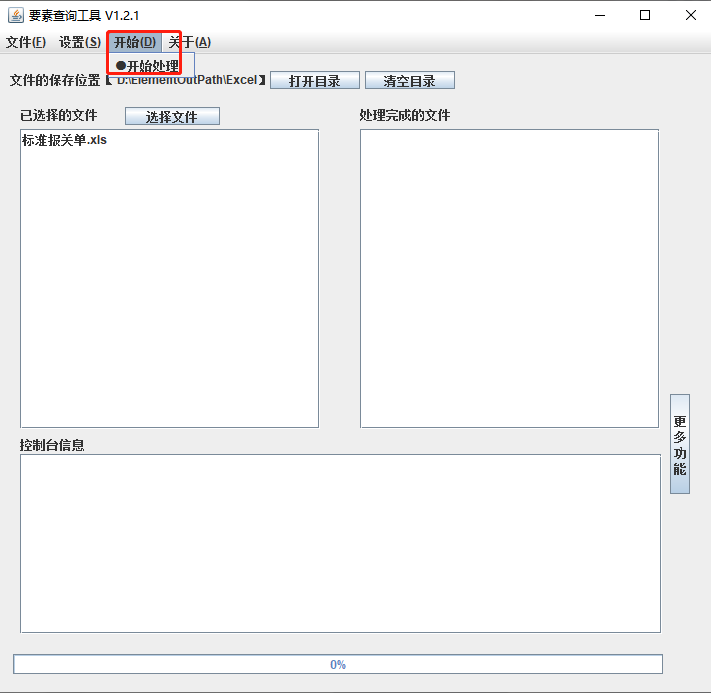
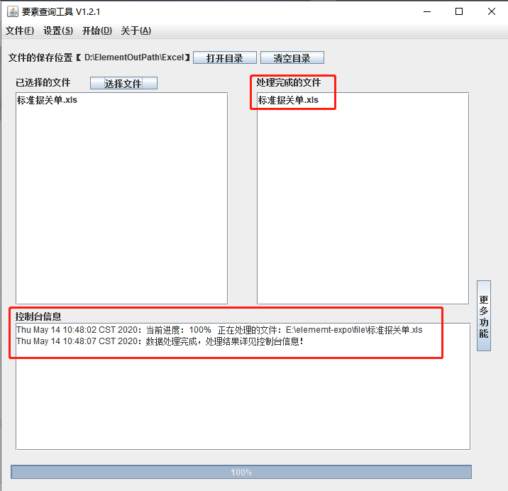

# elememt-expo

## 说明
本软件可根据`中华人民共和国海关出口货物报关单` （中华人民共和国海关出口货物报关单标准格式文件在/file目录下）， 标准格式的Excel文件，自动
查询相关的报关要素，并生成报关要素明细的Excel文件，具体文件格式见下面。

## 报关单Excel文件如图

## 软件使用说明

### 1. 点击选择文件，打开要查询申报要素的报关单（支持多文件批量查询）

### 2. 选择完成文件后，点击`开始处理`

### 3. 文件处理完成后，会在控制台输出相应的日志信息

